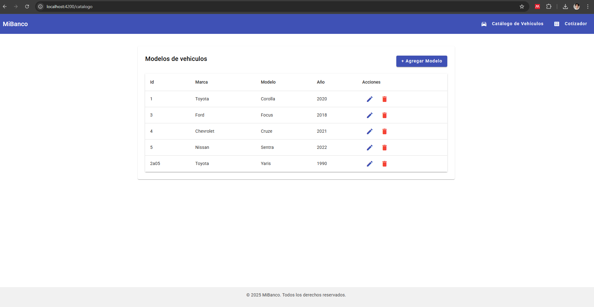
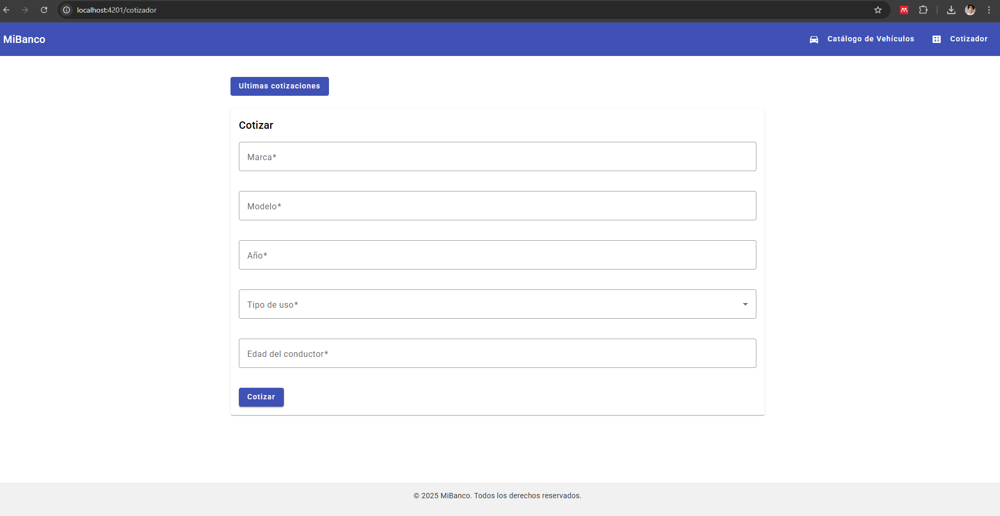
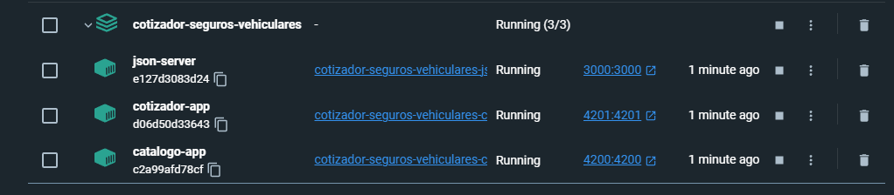

# Aplicación de Cotización de Seguros Vehiculares

Este repositorio contiene tres servicios independientes:

1. **App Catálogo de Modelos** – Gestión de modelos de vehículos (listar, crear, editar, eliminar).  
2. **App Cotizador de Seguros** – Formulario para cotizar un seguro, mostrar la cotizacion y ver las ultimas 3 cotizaciones.  
3. **JSON Server** – API falsa que almacena y recupera cotizaciones desde `db.json`.

---

## Tecnologías

- **Angular 17**  
- **Angular Material**  
- **json-server** (API REST simulada)  
- **Docker** & **Docker Compose**  
- **RxJS**, **Reactive Forms**, **HttpClient**

---

## Levantar todo con Docker

1. Clonar el repositorio:
   ```bash
   git clone https://github.com/sergiobazan/cotizador-seguros-vehiculares.git
   cd cotizador-seguros-vehiculares
   ```

2. Construir y arrancar los contenedores:
   ```bash
   docker-compose up --build
   ```

3. Acceder a las aplicaciones:
   - Catálogo de Modelos:   http://localhost:4200/catalogo  
   - Cotizador de Seguros:  http://localhost:4201/cotizador  
   - API Falsa (json-server): http://localhost:3000  

---

## Endpoints (json-server)

- `GET  /cotizador`   
- `POST /cotizador`  
- `GET  /models` 
- `POST /models` 
---

## Evidencias (Imágenes)

A continuación se muestran capturas de pantalla de la aplicación:

### Catálogo de Modelos


### Cotizador de Seguros


### Contenedores corriendo


---

## Autor

Desarrollado por **Sergio Bazan** 
